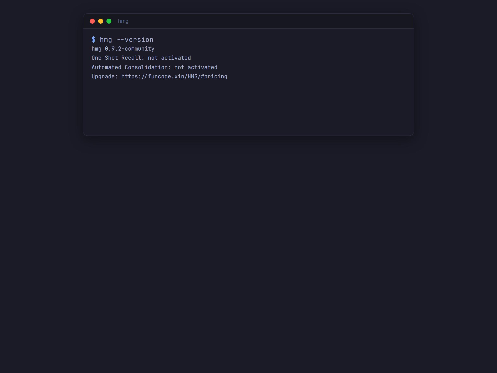
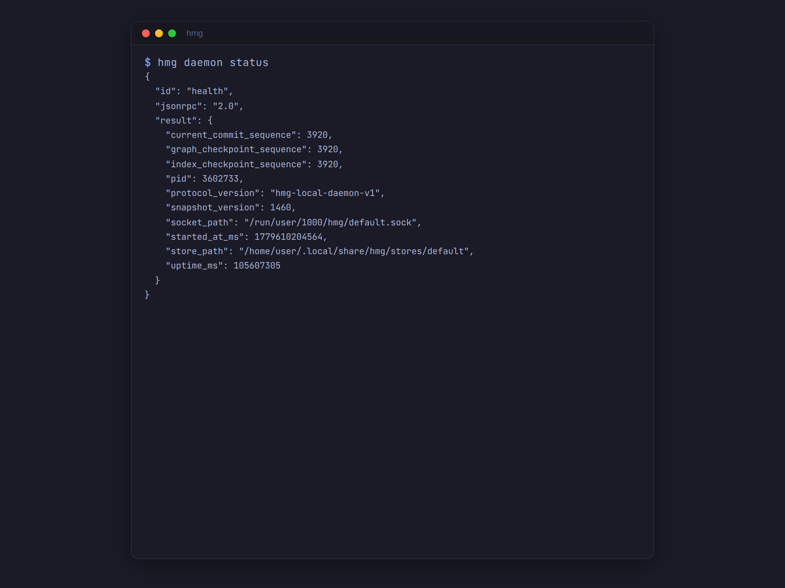
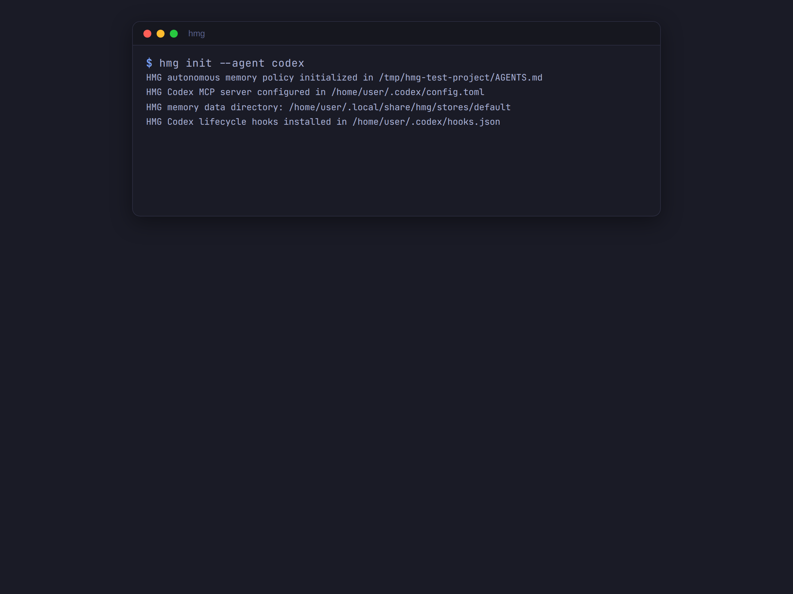
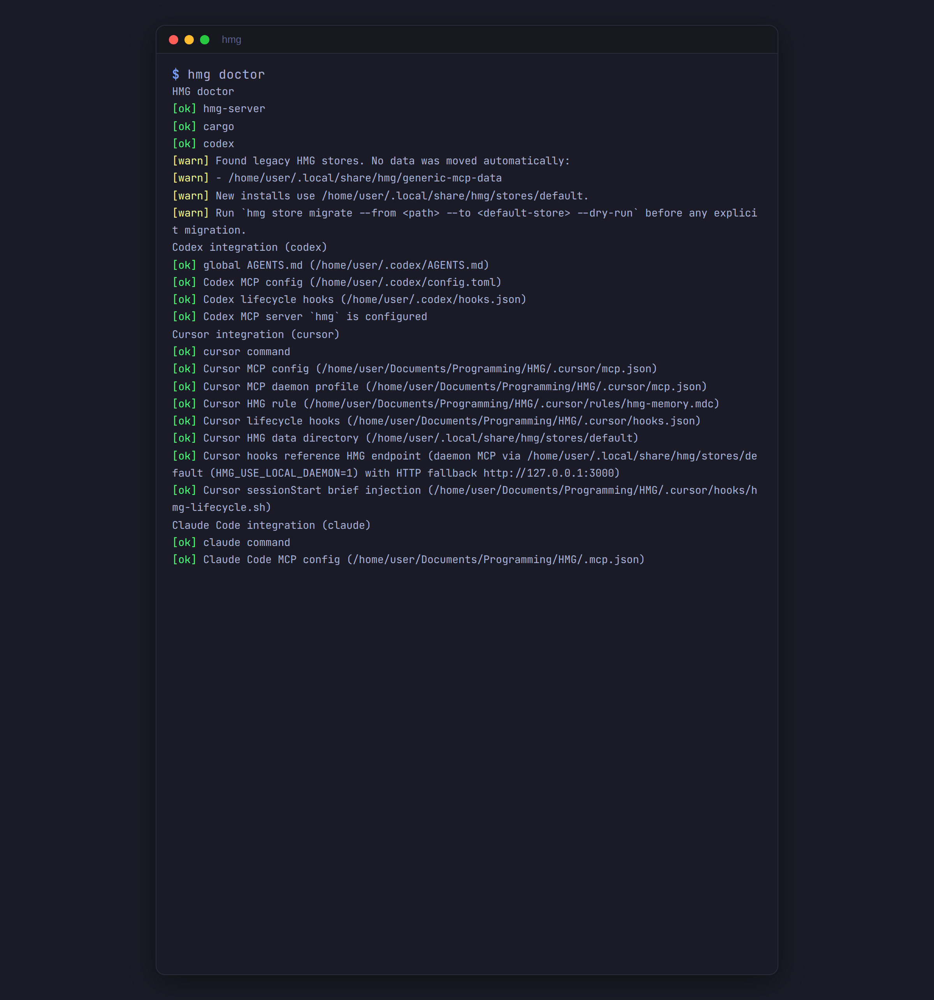
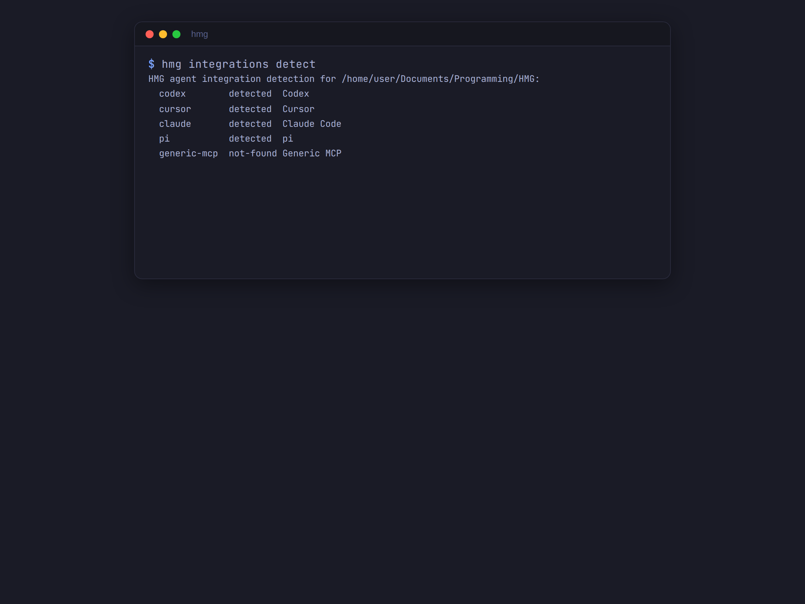
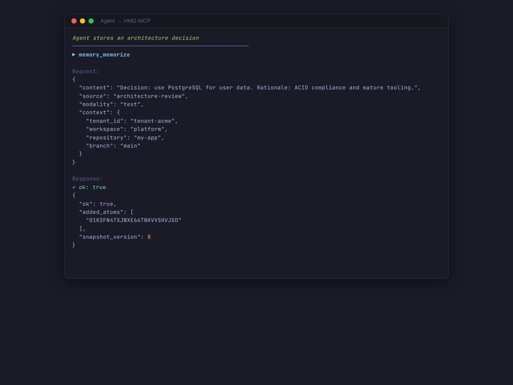
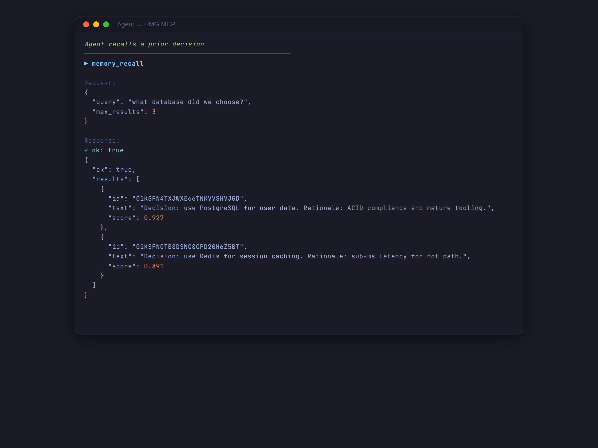
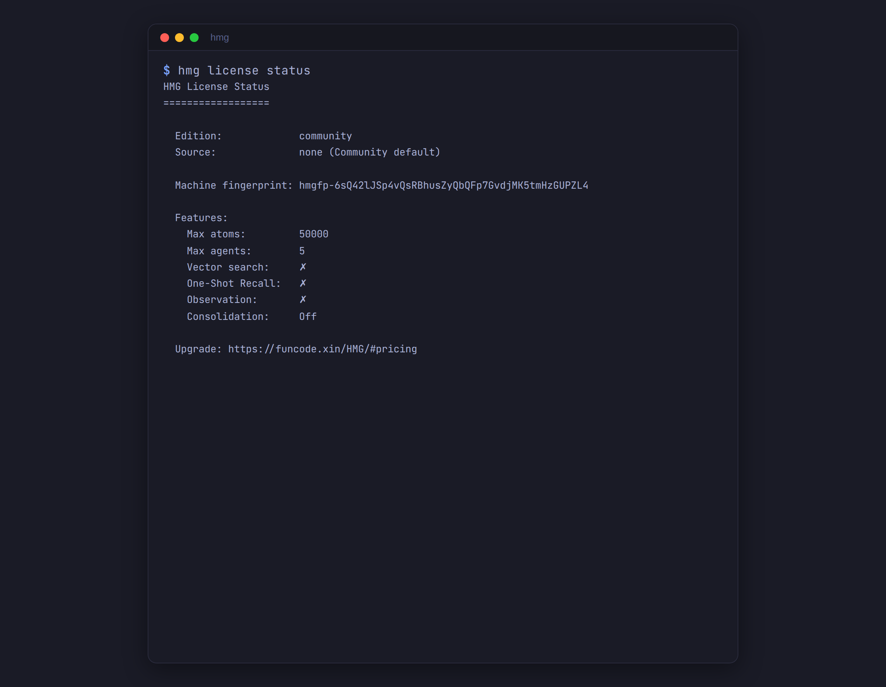

# Getting Started with HMG

## Prerequisites

- Linux (x86_64 or ARM64) or macOS (Intel or Apple Silicon)
- An AI agent or coding tool that supports MCP (Model Context Protocol)

## Install

```bash
curl -L https://funcode.xin/HMG/install.sh | sh
```

Or download directly from [GitHub Releases](https://github.com/HMG-AI/HMG/releases):

```bash
# Linux x86_64
curl -L https://github.com/HMG-AI/HMG/releases/latest/download/hmg-latest-x86_64-unknown-linux-gnu.tar.gz | tar -xzf - -C /usr/local/bin/

# macOS Apple Silicon
curl -L https://github.com/HMG-AI/HMG/releases/latest/download/hmg-latest-aarch64-apple-darwin.tar.gz | tar -xzf - -C /usr/local/bin/
```

## Verify

```bash
hmg --version
# hmg 0.9.2-community
```



## Start the Memory Service

```bash
hmg daemon start
```

The daemon starts a local MCP server at `~/.local/share/hmg/stores/default` by default.
No data leaves your machine.



## Connect Your Agent

### Cursor

```bash
hmg init --agent cursor
# Restart Cursor. HMG tools appear in MCP settings.
```

### Claude Code (Codex)

```bash
hmg init --agent codex
```



### Pi

```bash
hmg init --agent pi
```

### Generic MCP Client

HMG exposes a standard MCP server over stdio. Configure your client to run:

```json
{
  "mcpServers": {
    "hmg": {
      "command": "hmg-server",
      "args": ["~/.local/share/hmg/stores/default"]
    }
  }
}
```

## Verify Your Setup

```bash
hmg doctor
```

`hmg doctor` checks all integrations, daemon status, and MCP readiness:



## Detect Available Agents

```bash
hmg integrations detect
```



## First Memory

Use any MCP tool to store and retrieve memories:

```json
// Store a decision
{
  "tool": "memory_memorize",
  "arguments": {
    "content": "Decision: Use PostgreSQL for user data. Rationale: ACID compliance and mature tooling.",
    "source": "architecture-review",
    "modality": "text"
  }
}

// Recall later
{
  "tool": "memory_recall",
  "arguments": {
    "query": "What database did we choose?"
  }
}
```





## Edition and License

Check your current edition and feature limits:

```bash
hmg license status
```



## What's Available in Community Edition

| Feature | Available |
|---|---|
| Memory storage (memorize) | ✅ |
| Memory retrieval (recall) | ✅ Basic keyword search |
| Correction lifecycle | ✅ Full |
| Governance lifecycle | ✅ Full |
| MCP protocol | ✅ Full |
| HTTP API | ✅ Full |
| Agent integration | ✅ All adapters |
| One-Shot Recall Engine | ❌ Developer/Enterprise |
| Automated consolidation | ❌ Developer/Enterprise |
| Domain Packs | ❌ Developer/Enterprise |
| Semantic (vector) search | ❌ Developer/Enterprise |

## Next Steps

- [Concepts](concepts.md) — understand memory atoms, correction, governance, scope
- [Architecture](architecture.md) — how HMG works, plus TUI visual tour
- [API Reference](api-reference.md) — all MCP tools and HTTP endpoints
- [Correction and Governance](correction-governance.md)
- [FAQ](faq.md)
- [Upgrade to Developer](upgrade.md)
